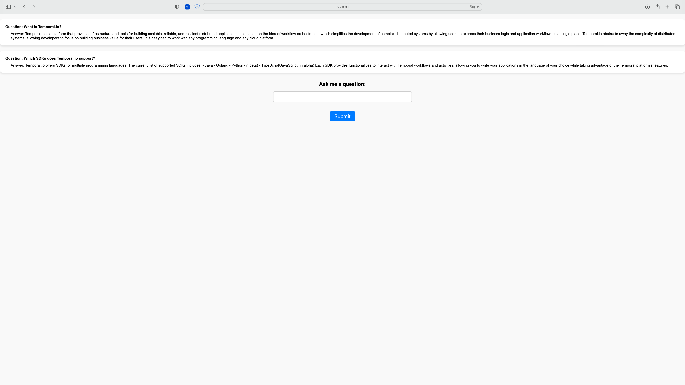
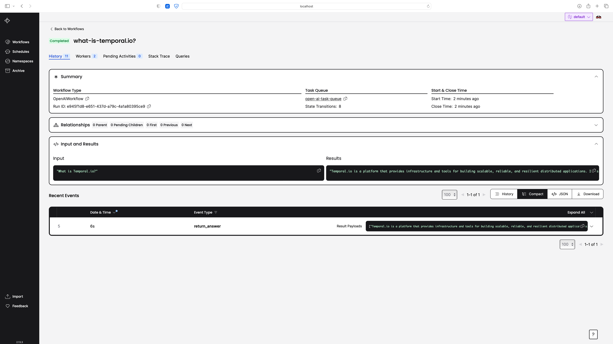

# README

This repository contains a Flask application that demonstrates how to use Temporal and OpenAI to build a simple chatbot. The chatbot is implemented using a workflow that uses an activity to call the OpenAI API to generate responses to user questions. 

## Running the application

### Prerequisites:

- Python >= 3.7
- [Poetry](https://python-poetry.org)
- [Local Temporal server running](https://docs.temporal.io/application-development/foundations#run-a-development-cluster)
- [Open AI keys](https://platform.openai.com/account/api-keys)
  - Create an `.env` file and save your key as `OPENAI_API_KEY="$SecretKEY`.

With this repository cloned, run the following at the root of the directory:

```bash
poetry install
```

1. Start the Temporal server by running `temporal server start-dev`.
2. In a new terminal window, start the worker by running `poetry run python run_worker.py`
3. In another terminal window, start the Flask application by running `python run_workflow.py`.
4. Open your web browser and go to `http://localhost:5000`.

## UI

Interact with the model with the Flask UI.



See the results from Temporal's Web UI at: <http://localhost:8233/>.



## Files

### your_activities.py

This file defines an activity called `return_answer`, which calls the OpenAI API to generate responses to user questions. It takes an instance of a `OpenAIQuestion` dataclass, which contains the user's question, and returns a string containing the response.

### your_openai.py

This file defines a workflow called `OpenAIWorkflow`. The `run` method takes a question string as input and calls the `return_answer` activity to generate a response. The workflow returns the response as a string.

### run_workflow.py

This file defines a Flask application that serves as a user interface for the chatbot. When the user submits a question, the application creates an instance of `OpenAIWorkflow` and executes it using the Temporal client. The application then displays the user's question and the response generated by the chatbot.

### run_worker.py

This file starts the Temporal worker, which listens for and executes workflows and activities. It uses the `return_answer` activity and the `OpenAIWorkflow` workflow.